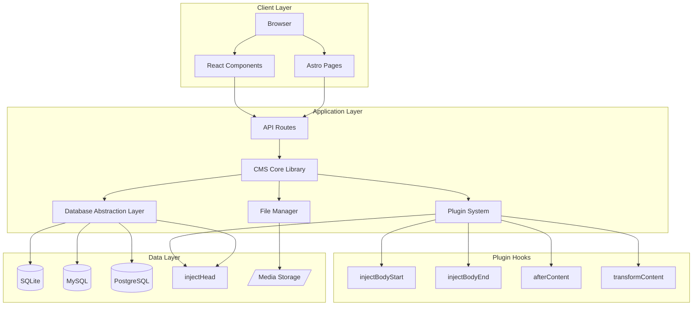

<p align="center">
  
</p>

<h1 align="center">EZ CMS</h1>

<p align="center">
  <strong>A powerful, flexible, and developer-friendly Content Management System built with Astro</strong>
</p>

<p align="center">
  <a href="#-key-features">Features</a> •
  <a href="#-getting-started">Getting Started</a> •
  <a href="#-architecture">Architecture</a> •
  <a href="#-documentation">Docs</a> •
  <a href="#-contributing">Contributing</a>
</p>

<p align="center">
  
  
  
  
  
</p>

---

## 📖 Introduction

**EZ CMS** is a modern, self-hosted content management system designed to provide a seamless experience for developers and content creators alike. Built on the lightning-fast [Astro](https://astro.build) framework with React components, EZ CMS combines the flexibility of a headless CMS with the simplicity of traditional content management.

Whether you're building a personal blog, a corporate website, or a full-featured web application, EZ CMS provides the tools you need without the complexity you don't.

### Why EZ CMS?

- 🚀 **Blazing Fast** — Powered by Astro's partial hydration for optimal performance
- 🔧 **Developer-Friendly** — TypeScript-first with full type safety
- 📦 **Self-Hosted** — Your data, your server, your rules
- 🎨 **Modern Admin UI** — Beautiful, responsive admin panel built with React
- 🔌 **Extensible** — Plugin architecture for infinite customization
- 💾 **Database Agnostic** — SQLite, MySQL, PostgreSQL, or Supabase — your choice

---

## ✨ Key Features

### Content Management
- **📝 Rich Text Editor** — Powered by TipTap with code highlighting, images, and links
- **📄 Posts & Pages** — Manage blog posts and static pages with ease
- **🏷️ Categories & Tags** — Organize content with flexible taxonomies
- **👥 Authors & Users** — Multi-user support with role-based access
- **📁 Media Library** — Upload and manage images, documents, and files

### Visual Page Builder
- **🧱 Drag & Drop Interface** — Build pages visually without writing code
- **📱 Responsive Preview** — Desktop, tablet, and mobile device simulation
- **🎨 Element Library** — Sections, rows, columns, text, images, buttons, videos, CTAs, and more
- **⚙️ Fine-Tuned Controls** — Customize every aspect of your design

### Advanced Custom Fields (ACF)
- **🔤 20+ Field Types** — Text, number, WYSIWYG, image, gallery, repeater, flexible content, and more
- **📋 Field Groups** — Organize fields and attach them to specific content types
- **🔄 Repeater & Flexible Content** — Create dynamic, nested data structures

### Plugin System
- **🔌 Built-in Plugins** — Analytics, Code Highlighter, Comments, Newsletter, SEO Optimizer, Social Sharing
- **🪝 Hook System** — 9 lifecycle hooks for deep integration
- **⚙️ Plugin Settings** — Configure plugins through the admin panel

### Multi-Database Support
- **📦 SQLite** — Zero-config, perfect for development and small sites
- **🐬 MySQL** — Battle-tested for production environments
- **🐘 PostgreSQL** — Enterprise-grade reliability and features
- **⚡ Supabase** — API-based connection, perfect for Vercel deployments

---

## 🏗️ Architecture

EZ CMS follows a modular architecture designed for scalability and maintainability.



### Core Components

| Component | Description |
|-----------|-------------|
| **Astro Pages** | Server-rendered pages with islands architecture |
| **React Components** | Interactive UI elements (Admin Panel, Page Builder) |
| **API Routes** | RESTful endpoints for CRUD operations |
| **CMS Core** | Business logic for content management |
| **Database Layer** | Adapter pattern for multi-database support |
| **Plugin System** | Extensible hook-based architecture |

---

## 🚀 Getting Started

### Prerequisites

- [Node.js](https://nodejs.org/) 18.x or higher
- [Bun](https://bun.sh/) (recommended) or npm/pnpm

### Installation

1. **Clone the repository**

```bash
git clone https://github.com/yourusername/ez-cms-astro.git
cd ez-cms-astro
```

2. **Install dependencies**

```bash
bun install
```

3. **Set up environment variables**

```bash
cp .env.example .env
```

4. **Start the development server**

```bash
bun run dev
```

5. **Open your browser**

Navigate to [http://localhost:4321](http://localhost:4321) to see your site, and [http://localhost:4321/admin](http://localhost:4321/admin) for the admin panel.

---

## 🔧 Running the Project

### Development

```bash
# Start development server with hot reload
bun run dev

# The site will be available at http://localhost:4321
```

### Production Build

```bash
# Build for production
bun run build

# Preview the production build locally
bun run preview
```

### Astro CLI Commands

```bash
# Run Astro CLI commands
bun astro <command>

# Examples
bun astro add react        # Add React integration
bun astro check            # Check for TypeScript errors
bun astro --help           # Show all available commands
```

### Commands Summary

| Command | Description |
|---------|-------------|
| `bun install` | Install dependencies |
| `bun run dev` | Start local dev server at `localhost:4321` |
| `bun run build` | Build production site to `./dist/` |
| `bun run preview` | Preview production build locally |
| `bun run astro ...` | Run Astro CLI commands |

---

## ⚙️ Environment Configuration

Create a `.env` file in the project root with the following variables:

### Database Configuration

EZ CMS supports three database types. Configure one based on your needs:

#### SQLite (Default)

```env
# Recommended for development and small sites
DB_TYPE=sqlite
DB_SQLITE_PATH=./data/cms.db
```

#### MySQL

```env
DB_TYPE=mysql
DB_MYSQL_HOST=localhost
DB_MYSQL_PORT=3306
DB_MYSQL_USER=root
DB_MYSQL_PASSWORD=your_password
DB_MYSQL_DATABASE=cms
```

#### PostgreSQL

```env
DB_TYPE=postgresql
DB_PG_HOST=localhost
DB_PG_PORT=5432
DB_PG_USER=postgres
DB_PG_PASSWORD=your_password
DB_PG_DATABASE=cms
```

### Environment Variables Reference

| Variable | Type | Default | Description |
|----------|------|---------|-------------|
| `DB_TYPE` | `sqlite` \| `mysql` \| `postgresql` | `sqlite` | Database engine to use |
| `DB_SQLITE_PATH` | `string` | `./data/cms.db` | Path to SQLite database file |
| `DB_MYSQL_HOST` | `string` | `localhost` | MySQL server hostname |
| `DB_MYSQL_PORT` | `number` | `3306` | MySQL server port |
| `DB_MYSQL_USER` | `string` | `root` | MySQL username |
| `DB_MYSQL_PASSWORD` | `string` | — | MySQL password |
| `DB_MYSQL_DATABASE` | `string` | `cms` | MySQL database name |
| `DB_PG_HOST` | `string` | `localhost` | PostgreSQL server hostname |
| `DB_PG_PORT` | `number` | `5432` | PostgreSQL server port |
| `DB_PG_USER` | `string` | `postgres` | PostgreSQL username |
| `DB_PG_PASSWORD` | `string` | — | PostgreSQL password |
| `DB_PG_DATABASE` | `string` | `cms` | PostgreSQL database name |
| `SUPABASE_URL` | `string` | — | Supabase project URL |
| `SUPABASE_SERVICE_ROLE_KEY` | `string` | — | Supabase service role key (for API access) |

---

## 📁 Folder Structure

```
ez-cms-astro/
├── public/                     # Static assets (favicon, images)
├── data/                       # SQLite database files
├── src/
│   ├── components/             # React & Astro components
│   │   ├── acf/                # Advanced Custom Fields components
│   │   ├── admin/              # Admin panel components
│   │   ├── page-builder/       # Visual page builder
│   │   │   ├── Canvas.tsx
│   │   │   ├── ElementLibrary.tsx
│   │   │   ├── ElementSettings.tsx
│   │   │   ├── PageBuilder.tsx
│   │   │   └── elements/       # Individual element renderers
│   │   └── site/               # Public site components
│   │
│   ├── content/                # Content storage & configuration
│   │   ├── config.json         # Site configuration
│   │   ├── posts/              # Blog posts
│   │   ├── pages/              # Static pages
│   │   ├── categories/         # Category definitions
│   │   ├── authors/            # Author profiles
│   │   └── menus/              # Navigation menus
│   │
│   ├── layouts/                # Page layouts
│   │   ├── BaseLayout.astro    # Main HTML structure
│   │   ├── AdminLayout.astro   # Admin panel wrapper
│   │   └── SiteLayout.astro    # Public site wrapper
│   │
│   ├── lib/                    # Core libraries
│   │   ├── cms/                # CMS core functionality
│   │   │   ├── database/       # Database adapters
│   │   │   │   ├── index.ts
│   │   │   │   ├── types.ts
│   │   │   │   ├── sqlite-adapter.ts
│   │   │   │   ├── mysql-adapter.ts
│   │   │   │   ├── postgresql-adapter.ts
│   │   │   │   └── supabase-adapter.ts
│   │   │   ├── config.ts       # Configuration loader
│   │   │   ├── plugins.ts      # Plugin manager
│   │   │   ├── themes.ts       # Theme manager
│   │   │   ├── users.ts        # User management
│   │   │   └── types.ts        # TypeScript definitions
│   │   ├── acf/                # Advanced Custom Fields
│   │   └── page-builder/       # Page builder types & utilities
│   │
│   ├── pages/                  # Astro pages & API routes
│   │   ├── index.astro         # Homepage
│   │   ├── about.astro         # About page
│   │   ├── [...slug].astro     # Dynamic content pages
│   │   ├── admin/              # Admin panel pages
│   │   │   ├── index.astro     # Dashboard
│   │   │   ├── posts/          # Post management
│   │   │   ├── pages/          # Page management
│   │   │   ├── categories.astro
│   │   │   ├── media.astro     # Media library
│   │   │   ├── plugins.astro   # Plugin management
│   │   │   ├── themes.astro    # Theme settings
│   │   │   └── settings.astro  # Site settings
│   │   ├── api/                # REST API endpoints
│   │   │   ├── posts/
│   │   │   ├── pages/
│   │   │   ├── categories/
│   │   │   ├── media/
│   │   │   ├── users/
│   │   │   ├── plugins.ts
│   │   │   └── settings.ts
│   │   └── blog/               # Blog listing pages
│   │
│   ├── plugins/                # Built-in plugins
│   │   ├── analytics/
│   │   ├── code-highlighter/
│   │   ├── comments/
│   │   ├── newsletter/
│   │   ├── seo-optimizer/
│   │   └── social-sharing/
│   │
│   └── styles/                 # Global styles
│       └── global.css
│
├── .env.example                # Environment template
├── astro.config.mjs            # Astro configuration
├── tailwind.config.mjs         # Tailwind configuration
├── tsconfig.json               # TypeScript configuration
└── package.json                # Dependencies & scripts
```

---

## 🔌 Plugin Development

EZ CMS uses a hook-based plugin architecture. Plugins are defined with a `manifest.json` and an `index.ts` implementation.

### Plugin Structure

```
src/plugins/my-plugin/
├── manifest.json       # Plugin metadata & configuration
└── index.ts            # Plugin implementation
```

### Manifest Example

```json
{
  "id": "my-plugin",
  "name": "My Plugin",
  "version": "1.0.0",
  "author": "Your Name",
  "description": "Description of what your plugin does.",
  "hooks": ["injectHead", "afterContent"],
  "defaultSettings": {
    "enabled": true,
    "customOption": "value"
  }
}
```

### Available Hooks

| Hook | Description | Return Type |
|------|-------------|-------------|
| `injectHead` | Inject content into `<head>` | `string` (HTML) |
| `injectBodyStart` | Inject content after `<body>` opens | `string` (HTML) |
| `injectBodyEnd` | Inject content before `</body>` | `string` (HTML) |
| `afterContent` | Append content after main content | `string` (HTML) |
| `transformContent` | Modify content before rendering | `string` (transformed content) |
| `beforeRender` | Execute before page render | `void` |
| `afterRender` | Execute after page render | `void` |
| `afterBuild` | Execute after production build | `void` |
| `onPageView` | Execute on page view events | `void` |
| `onFormSubmit` | Handle form submissions | `void` |

### Implementation Example

```typescript
// src/plugins/my-plugin/index.ts
export default {
  injectHead(settings: Record<string, unknown>): string {
    return `<script>console.log("Hello from my plugin!")</script>`;
  },

  afterContent(settings: Record<string, unknown>): string {
    return `<div class="my-plugin-widget">Widget Content</div>`;
  },
};
```

---

## 🤝 Contributing

We welcome contributions from the community! Here's how you can help:

### Getting Started

1. **Fork the repository** on GitHub

2. **Clone your fork** locally

```bash
git clone https://github.com/YOUR-USERNAME/ez-cms-astro.git
cd ez-cms-astro
```

3. **Create a feature branch**

```bash
git checkout -b feature/amazing-feature
```

4. **Make your changes** and commit them

```bash
git commit -m "feat: add amazing feature"
```

5. **Push to your branch**

```bash
git push origin feature/amazing-feature
```

6. **Open a Pull Request** on GitHub

### Contribution Guidelines

- **Code Style**: Follow the existing code style and use TypeScript
- **Commit Messages**: Use [Conventional Commits](https://www.conventionalcommits.org/) format
  - `feat:` for new features
  - `fix:` for bug fixes
  - `docs:` for documentation
  - `refactor:` for code refactoring
  - `test:` for adding tests
- **Pull Requests**: Include a clear description of changes and any related issues
- **Testing**: Ensure your changes don't break existing functionality

### Development Tips

- Use `bun run dev` for hot-reload development
- Check TypeScript errors with `bun astro check`
- Test with different database types before submitting

---

## 📄 License

This project is licensed under the **MIT License** — see the [LICENSE](LICENSE) file for details.

```
MIT License

Copyright (c) 2025 EZ CMS Contributors

Permission is hereby granted, free of charge, to any person obtaining a copy
of this software and associated documentation files (the "Software"), to deal
in the Software without restriction, including without limitation the rights
to use, copy, modify, merge, publish, distribute, sublicense, and/or sell
copies of the Software, and to permit persons to whom the Software is
furnished to do so, subject to the following conditions:

The above copyright notice and this permission notice shall be included in all
copies or substantial portions of the Software.

THE SOFTWARE IS PROVIDED "AS IS", WITHOUT WARRANTY OF ANY KIND, EXPRESS OR
IMPLIED, INCLUDING BUT NOT LIMITED TO THE WARRANTIES OF MERCHANTABILITY,
FITNESS FOR A PARTICULAR PURPOSE AND NONINFRINGEMENT. IN NO EVENT SHALL THE
AUTHORS OR COPYRIGHT HOLDERS BE LIABLE FOR ANY CLAIM, DAMAGES OR OTHER
LIABILITY, WHETHER IN AN ACTION OF CONTRACT, TORT OR OTHERWISE, ARISING FROM,
OUT OF OR IN CONNECTION WITH THE SOFTWARE OR THE USE OR OTHER DEALINGS IN THE
SOFTWARE.
```

---

## 🗺️ Roadmap

We're actively developing EZ CMS. Here's what's on the horizon:

### 🎯 In Progress
- [ ] **Authentication System** — Secure admin login with sessions
- [ ] **Image Optimization** — Automatic resizing and WebP conversion
- [ ] **Content Scheduling** — Schedule posts for future publication

### 📋 Planned
- [ ] **GraphQL API** — Alternative to REST for flexible queries
- [ ] **Markdown Support** — Write content in Markdown with MDX support
- [ ] **Content Versioning** — Track changes and restore previous versions
- [ ] **Multi-language Support** — i18n for content and admin panel
- [ ] **Theme Marketplace** — Browse and install community themes
- [ ] **Plugin Marketplace** — Discover and install third-party plugins
- [ ] **Headless Mode** — Use EZ CMS as a pure headless CMS
- [ ] **Docker Support** — One-command deployment with Docker Compose

### 🔮 Future Ideas
- [ ] **AI Content Assistant** — AI-powered content suggestions
- [ ] **Collaborative Editing** — Real-time multi-user editing
- [ ] **Advanced Analytics Dashboard** — Built-in visitor analytics
- [ ] **E-commerce Module** — Product management and checkout
- [ ] **Form Builder** — Visual form creation with validation

---

<p align="center">
  <strong>Built with ❤️ by the EZ CMS Team</strong>
</p>

<p align="center">
  <a href="https://github.com/yourusername/ez-cms-astro/issues">Report Bug</a> •
  <a href="https://github.com/yourusername/ez-cms-astro/issues">Request Feature</a> •
  <a href="https://github.com/yourusername/ez-cms-astro/discussions">Discussions</a>
</p>
